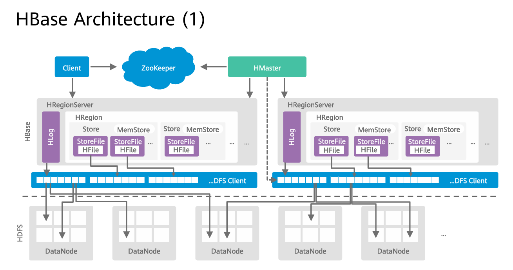
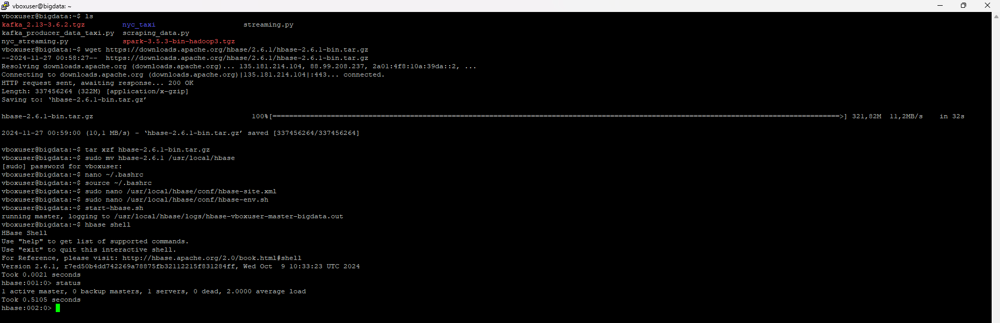
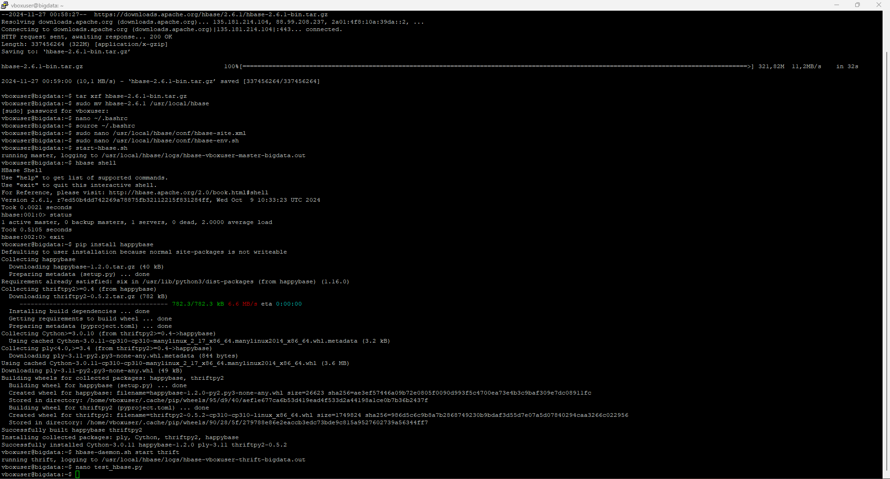
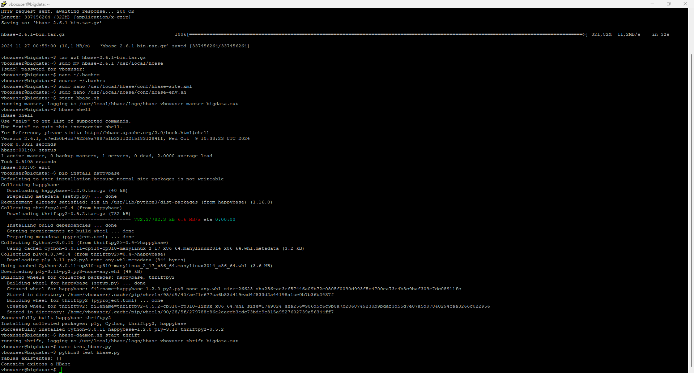
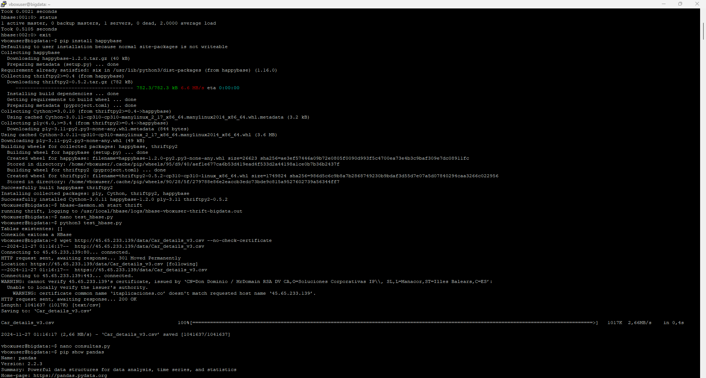
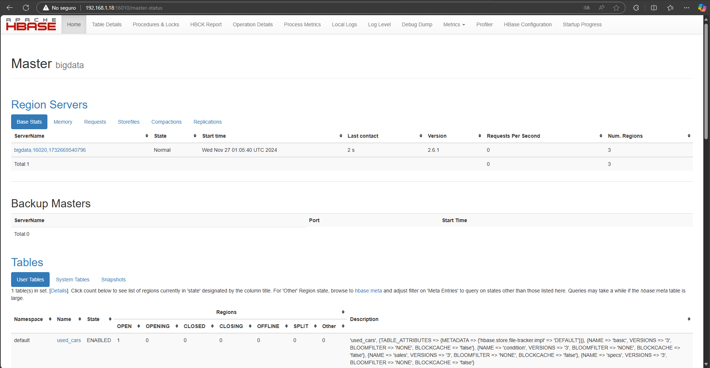
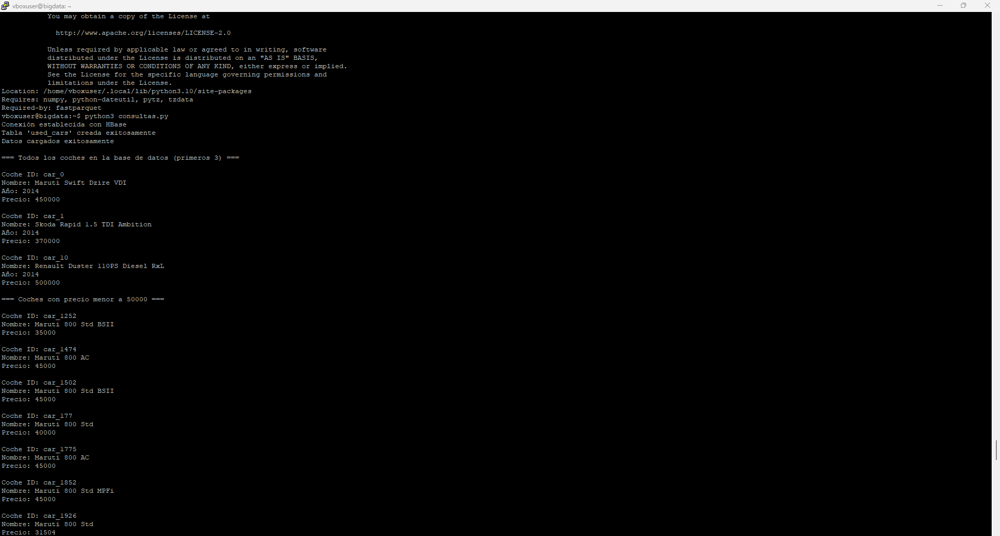
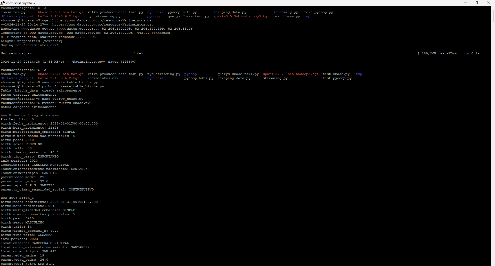
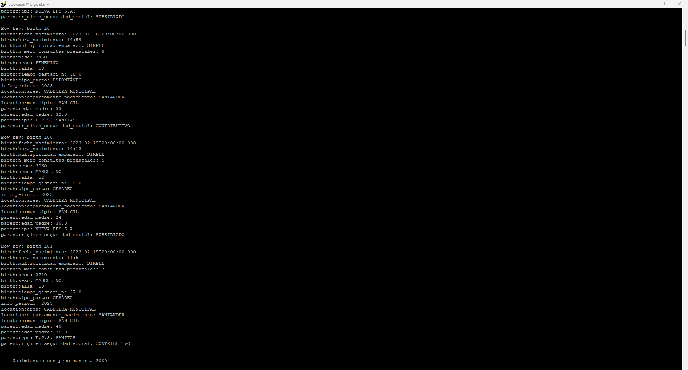
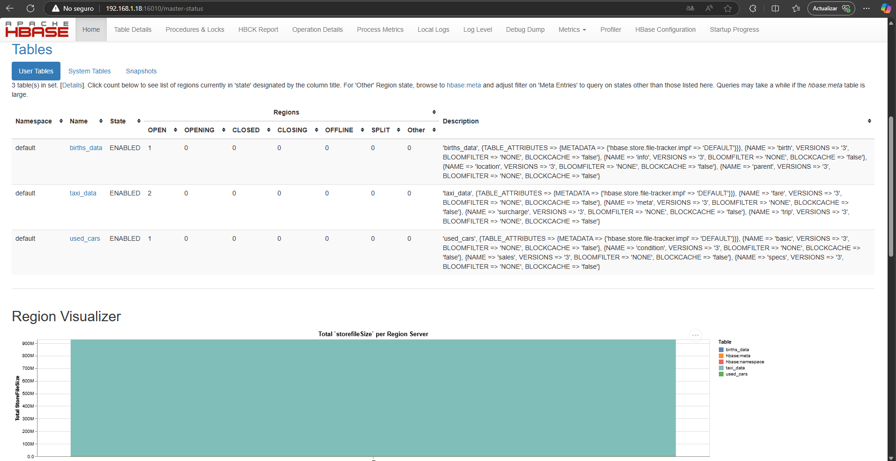

#  **Tarea  4 Almacenamiento y Consultas de Datos en Big Data** 

### **Arquitectura y componentes de Hbase** 

HBase tiene una arquitectura de tipo **maestro-esclavo** (master-slave) y se puede desplegar en decenas y cientos de nodos. La arquitectura de `HBase` se compone de los siguientes componentes:




## **Instalación de HBases**

### **Iniciamos sesión en la máquina virtual y en `PuTTy`** 

```bash
Usuario: vboxuser  
Password: bigdata 
```

Ejecutamos Putty para conectarnos por SSH a la máquina virtual utilizando la IP 
local

Descargamos Hbase 
    
```bash
wget https://downloads.apache.org/hbase/2.6.1/hbase-2.6.1-bin.tar.gz 
```

Extraemos el archivo y movemos la carpeta 
    
```bash
tar xzf hbase-2.6.1-bin.tar.gz
sudo mv hbase-2.6.1 /usr/local/hbase
```

Configuramos las Variables de Entorno 
Editamos el archivo `~/.bashrc` con `nano`: 

```bash
nano ~/.bashrc 
```

Anexamos las líneas siguientes al final del archivo. 
    
```bash 
export HBASE_HOME=/usr/local/hbase 
export PATH=$PATH:$HBASE_HOME/bin
```
copiar las líneas y damos `Crtl+O` enter y luego `Crtl+X` para salir 

Cargamos las variables de entorno: 
Cargue la configuración anterior en entorno actual 
    
```bash
source ~/.bashrc
```

Configuramos `HBase` 
Editamos el archivo `hbase-site.xml` para configurarlo en modo local, añadiendo las siguientes 
propiedades: 
        
```bash
sudo nano /usr/local/hbase/conf/hbase-site.xml 
```

Agregamos la siguiente configuración al final del archivo y antes de la etiqueta de 
cierre 
    
 ```xml
</configuration> 
<property> 
<name>hbase.rootdir</name> 
<value>file:///usr/local/hbase/data</value> 
</property> 
<property> 
<name>hbase.zookeeper.property.dataDir</name> 
<value>/usr/local/hbase/zookeeper</value> 
</property> 
<property> 
<name>hbase.cluster.distributed</name> 
<value>false</value> 
</property>
``` 

Editamos el archivo `hbase-env.sh` para configurar la ruta de Java:
```bash
sudo nano /usr/local/hbase/conf/hbase-env.sh
```

Anexamos la línea siguiente al final del archivo.  
```bash
export JAVA_HOME=/usr/lib/jvm/java-11-openjdk-amd64
``` 

Iniciamos `HBase `
Iniciamos el servicio de `HBase`: 
```bash
start-hbase.sh 
```

Verifica que HBase está corriendo: 
```bash
hbase shell 
```

Verificamos el status del servidor 
```bash
status
```

Digitamos `exit` para salir del `Shell` de Hbase

Instalación de Python y Dependencias 
Usaremos Python con `happybase`, una librería que permite interactuar con HBase desde 
Python 

```bash
pip install happybase 
```

Ejecutamos el servidor `thrift`
```bash 
hbase-daemon.sh start thrift 
```

Verificación de la Instalación 
Probamos la conexión desde Python, para esto creamos un archivo de prueba `test_hbase.py`: 

```bash
nano test_hbase.py 
```

Copiamos el contenido del archivo `test_hbase.py`: [test_hbase.py](tests/test_hbase.py)


Ejecutamos el script: 
```bash
python3 test_hbase.py 
```

Creamos un archivo `.py` donde nos conectaremos a Hbase, crearemos una tabla con sus 
respectivas familias y haremos algunas operaciones y consultas 
    
```bash
nano consultas.py 
```
Copiamos el contenido del archivo `test_hbase.py`: [consultas.py](tests/consultas.py)


Instalamos librerías necesarias 
```bash
pip install pandas 
```

Ejecutamos el script: 
```bash
python3 consultas.py
```

Podemos monitorear el servidor Hbase ingresando por la `URL` 

http://192.168.1.18:16010 

---

### **Evidencia de la instalación de HBase:**



Instalación de  happybase, una librería que permite interactuar con HBase desde 
Python

Prueba de conexión con HBase











---

# **Conjunto de datos utilizado**
El conjunto de datos empleado fue obtenido desde [datos.gov.co](https://www.datos.gov.co/resource/Nacimeintos.csv) y contiene información de nacimientos, con 928 filas y 17 columnas, relacionadas con detalles demográficos, características de los recién nacidos, y datos de los padres. Los datos se descargaron utilizando el comando:

```bash
wget https://www.datos.gov.co/resource/Nacimeintos.csv
```

### **Descripción de las columnas**

| Columna                  | Descripción                                      |
|--------------------------|--------------------------------------------------|
| **periodo**              | Año y mes del nacimiento.                        |
| **departamento**         | Departamento donde ocurrió el nacimiento.        |
| **municipio**            | Municipio donde ocurrió el nacimiento.           |
| **area**                 | Área (urbana o rural) del nacimiento.            |
| **sexo**                 | Sexo del recién nacido.                          |
| **peso**                 | Peso del recién nacido en gramos.                |
| **talla**                | Talla del recién nacido en centímetros.          |
| **fecha_nacimiento**     | Fecha de nacimiento.                             |
| **hora_nacimiento**      | Hora de nacimiento.                              |
| **tiempo_gestacion**     | Tiempo de gestación en semanas.                  |
| **consultas_prenatales** | Número de consultas prenatales.                  |
| **tipo_parto**           | Tipo de parto (espontáneo, cesárea, instrumentado). |
| **multiplicidad**        | Si el nacimiento fue único o múltiple.           |
| **edad_madre**           | Edad de la madre.                                |
| **regimen_seguridad_social** | Régimen de seguridad social de la madre.    |
| **eps**                  | EPS de la madre.                                 |
| **edad_padre**           | Edad del padre.                                  |

#### **Propósito del análisis**
El análisis de este conjunto de datos tiene como objetivo:
- Identificar patrones y tendencias en los nacimientos.
- Analizar la distribución de nacimientos por diferentes características.
- Evaluar la relación entre las características de los recién nacidos y los datos demográficos.
- Realizar consultas y operaciones sobre los datos almacenados en `HBase` para obtener información relevante.


### **Estructura de la tabla en HBase**
Se definió la tabla `births_data` en HBase con las siguientes familias de columnas:

- **`info`**: Período de nacimiento.
- **`location`**: Datos geográficos como departamento, municipio, y área de nacimiento.
- **`birth`**: Información sobre el nacimiento, como sexo, peso, talla, fecha y hora de nacimiento, tiempo de gestación, número de consultas prenatales, tipo de parto, y multiplicidad del embarazo.
- **`parent`**: Información de los padres, como edad de la madre, régimen de seguridad social, EPS, y edad del padre.

### **Creación de la tabla y carga de datos**
Se utilizó `happybase` para establecer una conexión con HBase, crear la tabla y cargar los datos del archivo CSV. Los datos se cargaron iterando sobre las filas del archivo CSV y utilizando claves de fila generadas dinámicamente (`birth_<índice>`).  

### **Código utilizado**
El script para la creación de la tabla y la carga de datos es el siguiente:
para más información del **script** [create_table_births.py](create_table_births.py)


```python
import happybase
import pandas as pd

connection = happybase.Connection('localhost')
table_name = 'births_data'
families = {
    'info': dict(),
    'location': dict(),
    'birth': dict(),
    'parent': dict()
}

if table_name.encode() in connection.tables():
    connection.delete_table(table_name, disable=True)

connection.create_table(table_name, families)
table = connection.table(table_name)

df = pd.read_csv('Nacimeintos.csv')
for index, row in df.iterrows():
    row_key = f'birth_{index}'.encode()
    data = {
        b'info:periodo': str(row['periodo']).encode(),
        # Resto de los datos omitidos por brevedad
    }
    table.put(row_key, data)

connection.close()
```

---

## **Operaciones realizadas en HBase**

### **Consultas de selección y filtrado**
1. Mostrar los primeros cinco registros de la tabla.
2. Encontrar nacimientos con peso menor a 3000 gramos.
3. Analizar la distribución de nacimientos por tipo de parto.

### **Operaciones de escritura**
Se implementaron las siguientes acciones sobre los datos en HBase:
- **Inserción**: Agregar un nuevo registro.
- **Actualización**: Modificar datos existentes.
- **Eliminación**: Eliminar un registro.

### **Ejemplo de una consulta**
```python
for key, data in table.scan(limit=5):
    print(f"Row key: {key.decode()}")
    for column, value in data.items():
        print(f"{column.decode()}: {value.decode()}")
```
 Para más información del script [querys_Hbase.py](querys_Hbase.py)

---

## **Análisis de resultados**

- **Distribución por tipo de parto**: 
  - Partos espontáneos: 462
  - Cesáreas: 459
  - Instrumentados: 7
- **Peso menor a 3000 gramos**: Se encontraron múltiples nacimientos, lo que podría ser un indicador de prematuridad o bajo peso.

---

## **Capturas de pantalla de los pasos realizados**








---

# **Referencias** 

[Apache HBase: Introducción](https://aprenderbigdata.com/hbase/)
